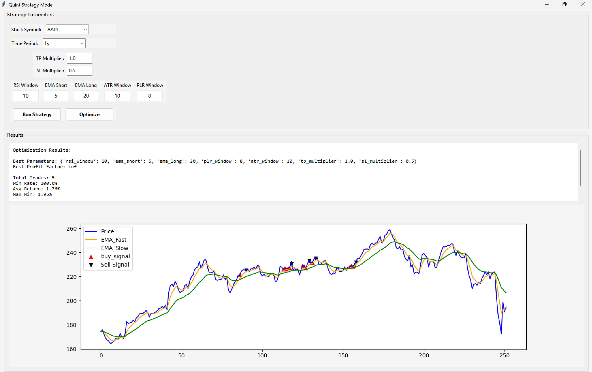

# StockpriceDA project
## Usecase
   This application is intended for stock market participants, including buyers and 
sellers, who want to optimize their decisions regarding financial assets and securities.
It is also valuable for financial analysts, providing a solid foundation to support and 
justify their decisions
## Description
   The application use some of the **technical analysis indicators** and some machine learning
model like **ARIMA**,**SVM** to make the better forcasting.

##  Requirements

### General
- Install **Python** > 3.6.

### Python Packages
To run the project, you need to install the following Python libraries:

- **Pandas**: Data manipulation and CSV file handling.
- **Numpy**: Basic function.
- **Matplotlib**: Data visualizations.

---

## Original Data

---

## Technical Analysis Tool

### 1. Moving strategy

### 2. Bollinger Bands

### 3. Momentum Oscillators

### 4. Relative strength index

some plot of Technical Analysis tool....

---

